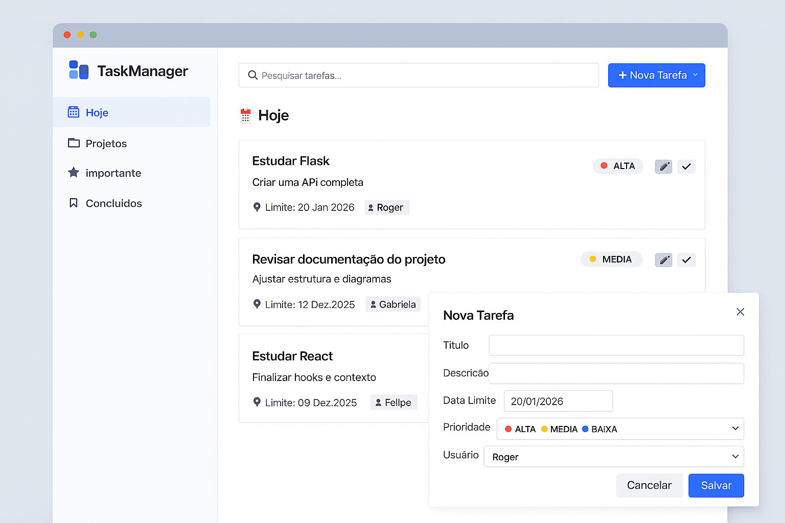
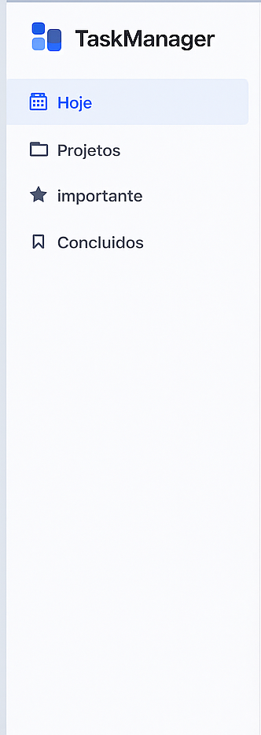
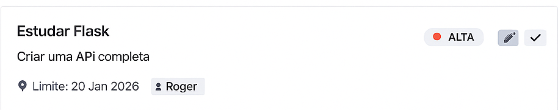

<div align="center">

# ✅ TaskManager

**Gerenciador de tarefas full-stack com API REST em Spring Boot e interface em React.**

[](https://openjdk.org/)
[](https://spring.io/projects/spring-boot)
[](https://www.postgresql.org/)
[](https://react.dev/)
[](https://www.typescriptlang.org/)
[](https://vite.dev/)
[](https://www.docker.com/)

[🌐 Ver aplicação online](https://task-manager-coral-theta-51.vercel.app) · [📬 Coleção Postman](collections/Collection_TaskManager.json)



</div>

---

## 📖 Sobre o projeto

O **TaskManager** permite cadastrar usuários e organizar tarefas por **prioridade**, **status** e **data limite**. O projeto é dividido em duas partes independentes:

- **Backend** (raiz do repositório): API REST em Java 21 com Spring Boot, persistência em PostgreSQL e validação de dados.
- **Frontend** (`taskmanager-front/`): SPA em React + TypeScript, que consome a API.

## ✨ Funcionalidades

- 📝 Criar, listar, consultar e excluir tarefas
- 🔄 Atualizar o status da tarefa (`PENDENTE` → `EM_ANDAMENTO` → `CONCLUIDA`)
- 🚦 Prioridades `BAIXA`, `MEDIA` e `ALTA`
- 👤 CRUD de usuários na API, com cada tarefa vinculada a um responsável
- 🗂️ Filtros na barra lateral: **Todas**, **Importante** (prioridade alta), **Em Andamento** e **Concluídos**
- ✔️ Validação das requisições com mensagens de erro claras e tratamento global de exceções
- 🔐 CORS configurável por variável de ambiente
- 🐳 Dockerfile multi-stage para build e deploy do backend

## 🖼️ Interface

<div align="center">

| Sidebar | Card de tarefa |
|:---:|:---:|
|  |  |

| Barra de pesquisa | Formulário de nova tarefa |
|:---:|:---:|
|  |  |

</div>

> As imagens acima são protótipos de interface da pasta `docs/`.

## 🛠️ Tecnologias

| Camada | Tecnologias |
|---|---|
| **Backend** | Java 21, Spring Boot 4.0, Spring Web MVC, Spring Data JPA, Bean Validation, Lombok, Maven |
| **Banco de dados** | PostgreSQL |
| **Frontend** | React 19, TypeScript, Vite, React Router, styled-components, Bulma, React Icons |
| **Infra** | Docker (multi-stage), Vercel (front), Render (API) |

## 🗺️ Estrutura do projeto

```
TaskMannager/
├── src/main/java/com/example/taskmanager/
│   ├── config/          # Configuração de CORS
│   ├── controller/      # Endpoints REST (tarefas e usuários)
│   ├── dto/             # Requests, responses e mappers
│   ├── exception/       # Tratamento global de erros
│   ├── model/           # Entidades JPA e enums
│   ├── repository/      # Repositórios Spring Data
│   └── service/         # Regras de negócio
├── src/main/resources/application.yaml
├── taskmanager-front/   # Aplicação React + Vite
├── collections/         # Coleção do Postman
├── docs/                # Imagens da interface
├── Dockerfile
└── pom.xml
```

## 🚀 Como executar

### Pré-requisitos

- [JDK 21](https://adoptium.net/)
- [Node.js](https://nodejs.org/) 20.19 ou superior e npm
- [PostgreSQL](https://www.postgresql.org/) em execução (ou Docker)

### 1. Banco de dados

Crie um banco chamado `taskmanager`:

```sql
CREATE DATABASE taskmanager;
```

As tabelas são criadas automaticamente pelo Hibernate (`ddl-auto: update`).

### 2. Backend

```bash
# na raiz do repositório
./mvnw spring-boot:run
```

A API sobe em `http://localhost:8080`.

#### Variáveis de ambiente

| Variável | Descrição | Padrão |
|---|---|---|
| `PORT` | Porta do servidor | `8080` |
| `DB_URL` | URL JDBC do PostgreSQL | `jdbc:postgresql://localhost:5432/taskmanager` |
| `DB_USER` | Usuário do banco | `postgres` |
| `DB_PASSWORD` | Senha do banco | definida em `application.yaml` — **sobrescreva com a sua** |
| `CORS_ORIGIN` | Origem permitida pelo CORS | `http://localhost:5173` |

Exemplo:

```bash
DB_USER=postgres DB_PASSWORD=sua_senha ./mvnw spring-boot:run
```

### 3. Frontend

```bash
cd taskmanager-front
npm install
npm run dev
```

A interface abre em `http://localhost:5173`.

O front lê o endereço da API na variável `VITE_API_URL`. Se ela não estiver definida, usa `http://localhost:8080/api/tarefas`. Para apontar para a sua API local, crie um `.env.local` dentro de `taskmanager-front/`:

```env
VITE_API_URL=http://localhost:8080/api/tarefas
```

### 🐳 Com Docker

```bash
docker build -t taskmanager .

docker run -p 8080:8080 \
  -e DB_URL=jdbc:postgresql://host.docker.internal:5432/taskmanager \
  -e DB_USER=postgres \
  -e DB_PASSWORD=sua_senha \
  -e CORS_ORIGIN=http://localhost:5173 \
  taskmanager
```

## 📡 API

URL base: `http://localhost:8080/api`

### Tarefas — `/tarefas`

| Método | Rota | Descrição |
|---|---|---|
| `GET` | `/tarefas` | Lista todas as tarefas |
| `GET` | `/tarefas/{id}` | Busca uma tarefa pelo id |
| `POST` | `/tarefas` | Cria uma tarefa |
| `PUT` | `/tarefas/{id}` | Atualiza uma tarefa |
| `PUT` | `/tarefas/{id}/status` | Atualiza apenas o status |
| `DELETE` | `/tarefas/{id}` | Remove uma tarefa |

**Exemplo de corpo para criar uma tarefa:**

```json
{
  "titulo": "Estudar Spring Boot",
  "descricao": "Criar API REST completa",
  "status": "PENDENTE",
  "dataCriacao": "2026-01-10",
  "dataLimite": "2026-01-20",
  "usuarioId": 1,
  "prioridade": "ALTA"
}
```

**Atualizar status:**

```json
{ "status": "CONCLUIDA" }
```

### Usuários — `/usuarios`

| Método | Rota | Descrição |
|---|---|---|
| `GET` | `/usuarios` | Lista os usuários |
| `GET` | `/usuarios/{id}` | Busca um usuário pelo id |
| `POST` | `/usuarios` | Cria um usuário |
| `PUT` | `/usuarios/{id}` | Atualiza um usuário |
| `DELETE` | `/usuarios/{id}` | Remove um usuário |

**Exemplo de corpo para criar um usuário:**

```json
{
  "nome": "João Silva",
  "email": "joao@email.com"
}
```

> 💡 Toda tarefa exige um `usuarioId` válido, então crie um usuário antes de cadastrar tarefas.

### Valores aceitos

| Campo | Valores |
|---|---|
| `status` | `PENDENTE`, `EM_ANDAMENTO`, `CONCLUIDA` |
| `prioridade` | `BAIXA`, `MEDIA`, `ALTA` |

Você também pode importar a [coleção do Postman](collections/Collection_TaskManager.json) para testar os endpoints rapidamente.

## 🧪 Scripts do frontend

| Comando | O que faz |
|---|---|
| `npm run dev` | Inicia o servidor de desenvolvimento |
| `npm run build` | Verifica os tipos e gera o build de produção |
| `npm run preview` | Serve localmente o build de produção |
| `npm run lint` | Executa o ESLint |

## 👨‍💻 Autor

Feito por **[rogercf17](https://github.com/rogercf17)**.

---

<div align="center">

Se este projeto foi útil para você, deixe uma ⭐ no repositório!

</div>
